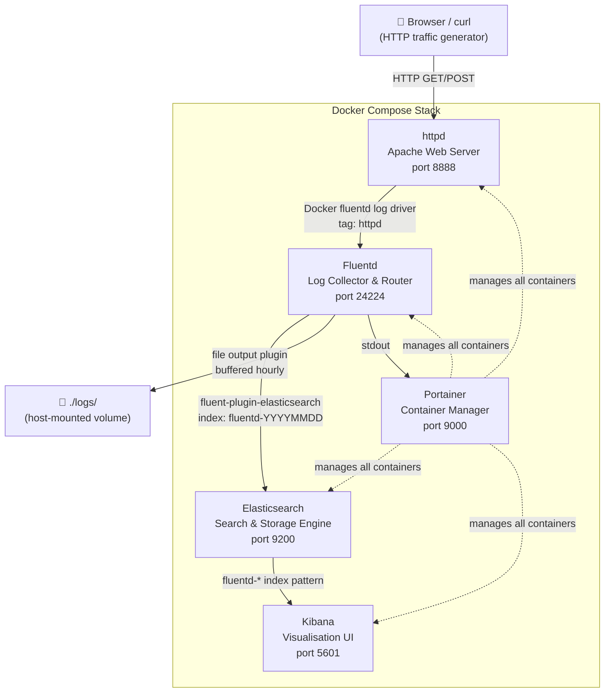
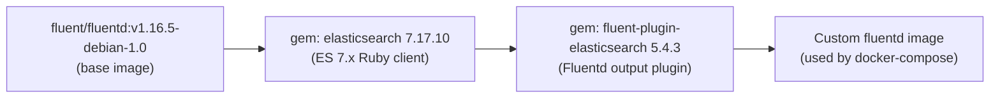
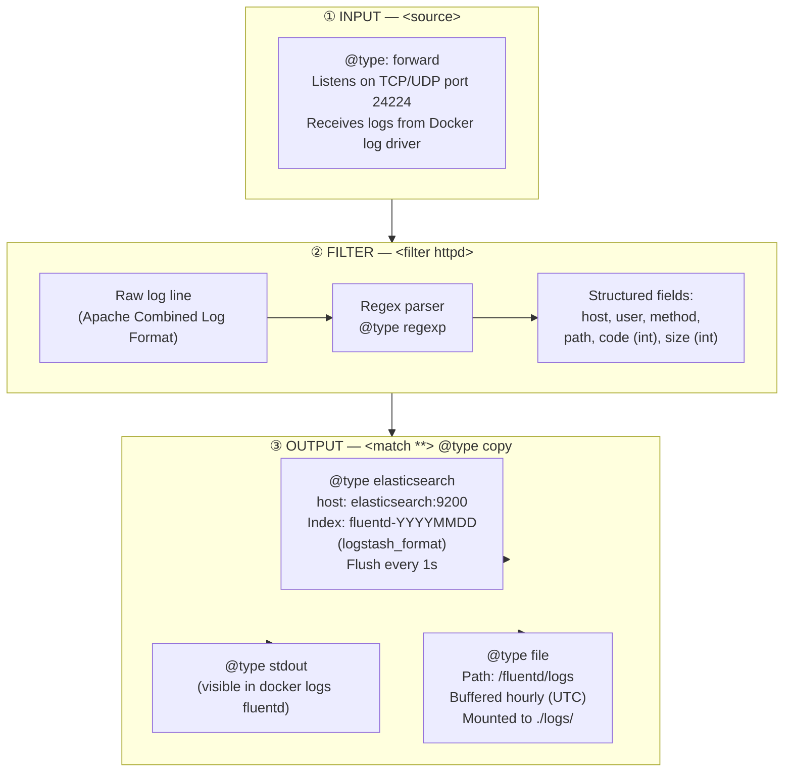
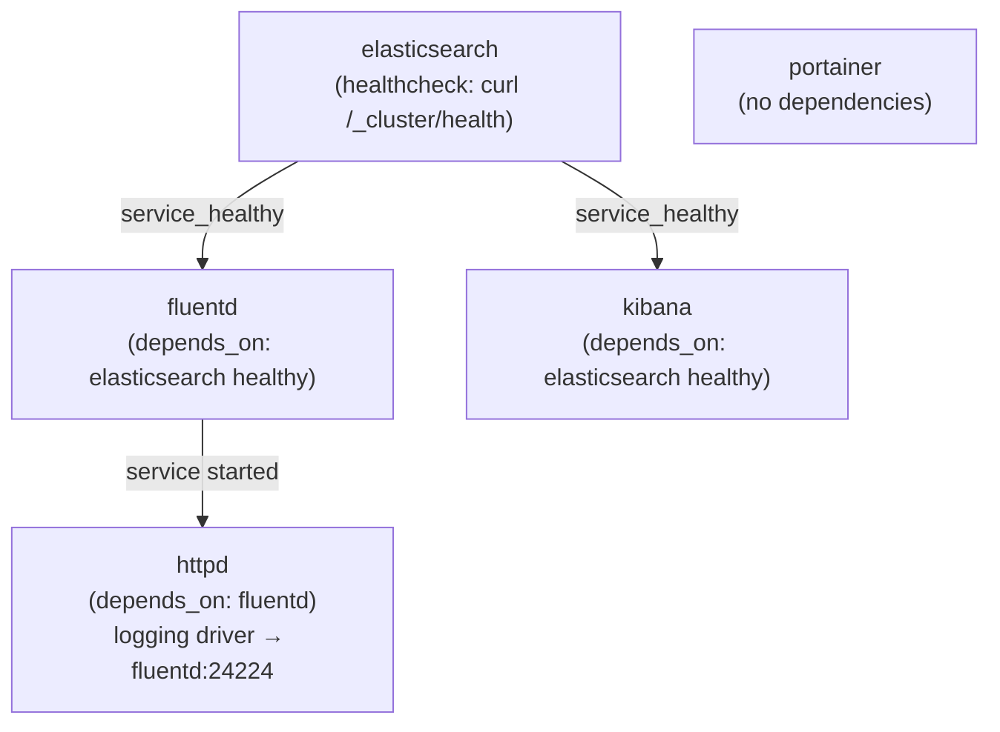
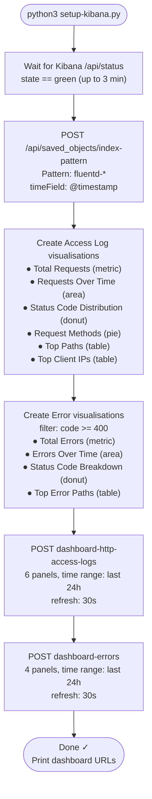

# Fluentd × Elasticsearch × Kibana (EFK Stack)

A fully containerised logging pipeline that collects Apache **httpd** access logs via **Fluentd**, stores them in **Elasticsearch**, and visualises them in **Kibana**. A **Portainer** instance is also included for container management.

---

## Table of Contents

- [Architecture Overview](#architecture-overview)
- [Service Map](#service-map)
- [How It Is Built](#how-it-is-built)
  - [1. Custom Fluentd Image](#1-custom-fluentd-image)
  - [2. Fluentd Configuration Pipeline](#2-fluentd-configuration-pipeline)
  - [3. Docker Compose Stack](#3-docker-compose-stack)
  - [4. Kibana Setup Script](#4-kibana-setup-script)
- [Log Flow — Step by Step](#log-flow--step-by-step)
- [Project Structure](#project-structure)
- [Quick Start](#quick-start)
- [Kibana Dashboards](#kibana-dashboards)
- [Service URLs](#service-urls)
- [Troubleshooting](#troubleshooting)

---

## Architecture Overview



---

## Service Map

| Service         | Image                                                  | Port  | Role                           |
| --------------- | ------------------------------------------------------ | ----- | ------------------------------ |
| `httpd`         | `httpd` (official)                                     | 8888  | Apache web server, log source  |
| `fluentd`       | Custom — built from `./fluentd/Dockerfile`             | 24224 | Log collector, parser, router  |
| `elasticsearch` | `docker.elastic.co/elasticsearch/elasticsearch:7.13.1` | 9200  | Log storage and search engine  |
| `kibana`        | `docker.elastic.co/kibana/kibana:7.13.1`               | 5601  | Dashboard and visualisation UI |
| `portainer`     | `portainer/portainer-ce:latest`                        | 9000  | Docker container management UI |

---

## How It Is Built

### 1. Custom Fluentd Image

The stock Fluentd image does not ship with an Elasticsearch output plugin compatible with ES 7.x. A custom image is built from [`fluentd/Dockerfile`](fluentd/Dockerfile):

```dockerfile
FROM fluent/fluentd:v1.16.5-debian-1.0
USER root

RUN gem install elasticsearch -v 7.17.10 && \
    gem install fluent-plugin-elasticsearch --no-document --version 5.4.3

USER fluent
```



> The gem versions are pinned to maintain compatibility with Elasticsearch **7.13.1**.

---

### 2. Fluentd Configuration Pipeline

The configuration file [`fluentd/conf/fluent.conf`](fluentd/conf/fluent.conf) defines three stages — **input**, **filter**, and **output**.



**Apache log regex** used in the filter:

```
/^(?<host>[^ ]*) [^ ]* (?<user>[^ ]*) \[(?<time>[^\]]*)\] "(?<method>\S+)(?: +(?<path>[^ ]*) +\S*)?" (?<code>[^ ]*) (?<size>[^ ]*)/
```

Extracted fields:

| Field    | Type    | Example       |
| -------- | ------- | ------------- |
| `host`   | string  | `172.18.0.1`  |
| `user`   | string  | `-`           |
| `method` | string  | `GET`         |
| `path`   | string  | `/index.html` |
| `code`   | integer | `200`         |
| `size`   | integer | `1234`        |

---

### 3. Docker Compose Stack

The [`docker-compose.yaml`](docker-compose.yaml) defines the full stack and its dependency chain:



**Key startup rules:**

- `elasticsearch` must pass its health check before `fluentd` and `kibana` start.
- `fluentd` must be running before `httpd` starts (because `httpd` uses the `fluentd` log driver immediately).
- `portainer` starts independently.

**Volumes & Ports:**

| Container     | Host mount / port               | Container path / port |
| ------------- | ------------------------------- | --------------------- |
| portainer     | `./runtime_data/portainer-data` | `/data`               |
| portainer     | `9000`                          | `9000`                |
| httpd         | `8888`                          | `80`                  |
| fluentd       | `./fluentd/conf`                | `/fluentd/etc`        |
| fluentd       | `./logs`                        | `/fluentd/logs`       |
| fluentd       | `24224` (TCP + UDP)             | `24224`               |
| elasticsearch | `9200`                          | `9200`                |
| kibana        | `5601`                          | `5601`                |

---

### 4. Kibana Setup Script

[`setup-kibana.py`](setup-kibana.py) is a pure-Python (no external deps) idempotent script that provisions Kibana via the **Saved Objects API**:



All POST requests use `?overwrite=true`, so the script is **safe to re-run** at any time.

---

## Log Flow — Step by Step

```mermaid
sequenceDiagram
    participant Client as Browser / curl
    participant httpd as httpd (port 8888)
    participant Docker as Docker log driver
    participant Fluentd as Fluentd (port 24224)
    participant ES as Elasticsearch (port 9200)
    participant Kibana as Kibana (port 5601)
    participant File as ./logs/ (host)

    Client->>httpd: HTTP Request (GET /, POST /submit, etc.)
    httpd-->>Client: HTTP Response (200, 404, 500…)
    httpd->>Docker: Write access log line (Apache Combined Format)
    Docker->>Fluentd: Forward log with tag "httpd"
    Note over Fluentd: Apply &lt;filter httpd&gt;<br/>Regex parse → extract fields
    Fluentd->>ES: Bulk index to fluentd-YYYYMMDD<br/>(flushed every 1s)
    Fluentd->>File: Append to hourly buffer file
    Fluentd->>Fluentd: Print to stdout
    Client->>Kibana: Open dashboard in browser
    Kibana->>ES: Query fluentd-* index pattern
    ES-->>Kibana: Aggregated results
    Kibana-->>Client: Render charts & tables
```

---

## Project Structure

```
.
├── docker-compose.yaml          # Full stack definition (5 services)
├── runMe.sh                     # One-command start: compose down + up --build
├── setup-kibana.py              # Idempotent Kibana provisioning script
│
├── fluentd/
│   ├── Dockerfile               # Adds ES 7.x gems to official fluentd image
│   └── conf/
│       └── fluent.conf          # Input → Filter (parse) → Output (ES + file + stdout)
│
└── logs/                        # Host-mounted volume — Fluentd file output lands here
```

---

## Quick Start

### 1. Start the entire stack

```bash
./runMe.sh
```

This runs:

```bash
docker compose down --remove-orphans   # clean up any previous run
docker compose up -d --build           # build custom fluentd image, start all services
```

### 2. Provision Kibana index pattern and dashboards

Run **once** after the stack is up (safe to re-run — idempotent):

```bash
python3 setup-kibana.py
```

The script waits for Kibana to become healthy, then creates the index pattern and both dashboards automatically.

### 3. Generate test traffic

```bash
# 10 normal requests (HTTP 200)
for i in {1..10}; do curl -s http://localhost:8888/; done

# 5 requests that trigger 404 errors
for i in {1..5}; do curl -s http://localhost:8888/not-found-$i; done
```

Open **http://localhost:5601** and navigate to Dashboards to see the data.

---

## Kibana Dashboards

> Kibana UI: **http://localhost:5601**

### HTTP Access Logs

Query filter: `@log_name: "httpd"`

| Panel                    | Type       | Description                     |
| ------------------------ | ---------- | ------------------------------- |
| Total Requests           | Metric     | Count of all requests           |
| Request Methods          | Pie chart  | GET / POST / HEAD breakdown     |
| Status Code Distribution | Donut      | 2xx / 3xx / 4xx / 5xx breakdown |
| Requests Over Time       | Area chart | Request volume over last 24 h   |
| Top Requested Paths      | Table      | Most-hit URL paths              |
| Top Client IPs           | Table      | Most-active source IPs          |

[Open dashboard →](http://localhost:5601/app/dashboards#/view/dashboard-http-access-logs)

### HTTP Errors (4xx / 5xx)

Query filter: `@log_name: "httpd" and code >= 400`

| Panel                       | Type       | Description                        |
| --------------------------- | ---------- | ---------------------------------- |
| Total Error Count           | Metric     | Colour-coded error total           |
| Error Status Code Breakdown | Donut      | 400 / 403 / 404 / 500 etc.         |
| Errors Over Time            | Area chart | Error rate over last 24 h          |
| Top Error Paths with Codes  | Table      | Paths that produce the most errors |

[Open dashboard →](http://localhost:5601/app/dashboards#/view/dashboard-errors)

---

## Service URLs

| Service           | URL                   |
| ----------------- | --------------------- |
| httpd (test site) | http://localhost:8888 |
| Elasticsearch API | http://localhost:9200 |
| Kibana            | http://localhost:5601 |
| Portainer         | http://localhost:9000 |

---

## Troubleshooting

```bash
# Check all container statuses and health
docker compose ps

# Follow Fluentd logs in real time
docker logs -f fluentd

# Query total documents stored in Elasticsearch
curl http://localhost:9200/fluentd-*/_count

# Check Elasticsearch cluster health
curl http://localhost:9200/_cluster/health?pretty

# Re-run Kibana provisioning (safe, idempotent)
python3 setup-kibana.py

# Inspect raw log files written by Fluentd
ls -lh ./logs/
```
